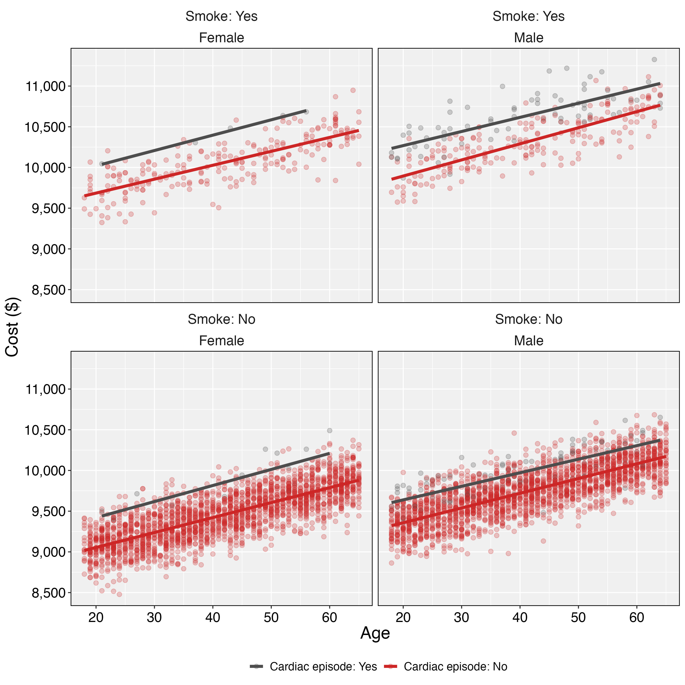

# HRP 203: Methods for Reproducible Population Health and Clinical Research

*Author:* Valeria Gracia Olvera

*Date:* May 19, 2024

## Assignment 7

This repository contains scripts to run an OLS analysis of 5000 simulated observations with `smoke`, `sex`, `age`, `cardiac`, and `cost` variables. Below I present the results.

### Descriptive statistics

Descriptive statistics for the two continuous variables are found in the following table.

| Variable             | Min  | Median |  Mean   |  Max  |
|:---------------------|:----:|:------:|:-------:|:-----:|
| **`age`** (in years) |  18  |   41   |  41.47  |  65   |
| **`cost`** (\$)      | 8478 |  9664  | 9672.27 | 11326 |

Finally, the distribution between smokers or non-smokers (`smoke`), those who had a cardiac event (`cardiac`) or not, by `sex`, is presented in the following table:

| `smoke` | `cardiac` | Female |  Male  |
|:-------:|:---------:|:------:|:------:|
|   Yes   |    Yes    | 0.0010 | 0.0144 |
|   No    |    Yes    | 0.0028 | 0.0198 |
|   Yes   |    No     | 0.0456 | 0.0406 |
|   No    |    No     | 0.4376 | 0.4382 |

### Analysis

I performed a simple OLS regression of cost on age, sex, cardiac event, and smokers. Here are the results:

`MODEL INFO: Observations: 5000 Dependent Variable: cost Type: OLS linear regression`

`MODEL FIT: F(4,4995) = 3859.29, p = 0.00 R² = 0.76 Adj. R² = 0.76`

|                   |    Est. |  S.E. | t val. |    p |
|-------------------|--------:|------:|-------:|-----:|
| **`(Intercept)`** | 9577.13 | 18.32 | 522.63 | 0.00 |
| **`age`**         |   18.21 |  0.21 |  87.50 | 0.00 |
| **`sexMale`**     |  293.65 |  5.70 |  51.48 | 0.00 |
| **`cardiacNo`**   | -289.22 | 15.22 | -19.00 | 0.00 |
| **`smokeNo`**     | -592.76 |  9.51 | -62.30 | 0.00 |

The following figure summarizes the relationship between the cost and the other variables of interest. We can see that the cost increases with age for men who smoke and have a cardiac event.

